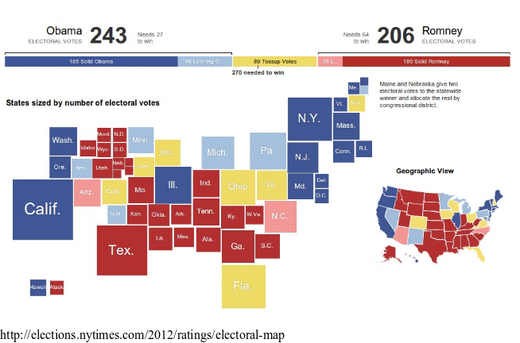
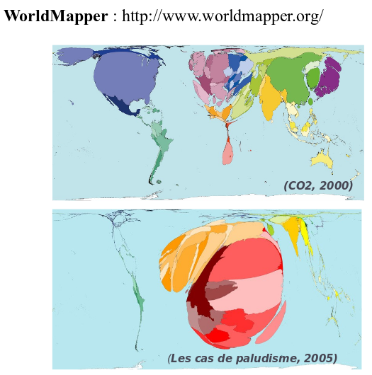

# Cartographie thématique avancée  {#jour3}

## Les anamorphoses

Voir : [Les anamorphoses cartographiques](https://neocarto.hypotheses.org/366)   
*Nicolas Lambert, 2015*


"L’anamorphose classique est une représentation des États (ou de mailles quelconques) par **des rectangles ou des polygones quelconques** en fonction d’une **quantité** qui leur est rattaché."  

"On s’efforce de **garder l’arrangement général** des mailles ou la silhouette du continent."


*Brunet, R., Ferras, R., & Théry, H. (1993). Les mots de la géographie: dictionnaire critique (No. 03) 911 BRU).*


### Les cartogrammes de Dorling

La taille des cercles est proportionnelle à une variable. 

La position des cercles est définie selon les positions de départ. 

*Dorling, Daniel (1996): Area Cartograms: Their Use and Creation, Concepts and Techniques in Modern Geography (CATMOG), 59*

### Le principe


### Exemple





### Précautions d'emploi

\- On identifie assez mal l'espace  
On peut nommer les cercles pour se repérer  
On peut s'aider de la couleur pour faire des clusters et mieux identifier les blocks géographiques  


\+ La perception de la quantité est très bonne.   
Les tailles de cercles sont vraiment comparables  


### Les cartogrammes non continus

La taille des polygones est proportionnelle à une variable.     

L'agencement des polygones les uns par rapport aux autres est conservée.   

La forme des polygones est ressemblante.   

### Exemple


### Précautions d'emploi

\- Non contigu, la topologie est perdue.

\+ La conservation de la forme des polygones est optimisée.


### Les cartogrammes continus


La taille des polygones est proportionnelle à une variable.  

L'agencement des polygones les uns par rapport aux autres est conservée.  

Pour conserver la contiguité, la forme des polygones est fortement transformée.  

### Exemple



### Précautions d'emploi

\- Par rapport aux anamorphoses non contigues, la forme des polygones est fortement distordue.

\+ C'est une “vraie carte de géographie” : la topologie et la contiguité sont conservées.


### Interêts des anamorphoses

Représentation cartographique perçue comme **innovante** (même si la methode date de 40 ans)

Image très généralisée qui rend bien compte des **quantités** et des **gradiants**. 

Une vraie image de **communication** : **provoque**, suscite **l’intérêt**, véhicule un **message** fort, **interpelle**.


### Faiblesses des anamorphoses

Perte des **repères visuels** (difficile de retrouver son pays, ou sa région sur la carte).

Ne permet pas de connaître les **situations locales**.

Demande un **effort de lecture**.

**Gestion des données manquantes**


## Les grilles régulières

La méthode du carroyage consiste à découper l’espace géographique en un maillage formé de carrés réguliers dans une projection donnée. La donnée est répartie sur ce quadrillage régulier au prorata de la surface représentée. Le quadrillage permet ainsi de s’affranchir des mailles administratives.

La fonction getGridLayer du package cartography permet de construire ces grilles régulières.


### Exemples


```{r}
knitr::include_graphics(c("img/pregrid.png", "img/grid.png"))

```


### Précautions d'emploi

\- Perte de précision, maillage sans signification.   
La version simple (au prorata de la surface), implique une equirépartition du phénomène dans chaque unités. 


\+ Permet la comparaison de maillages différents, à plusieurs dates ou de différentes sources. 


## Les discontinuités

Ce type de représentation permet de souligner cartographiquement les discontinuités territoriales d'un phénomène. 

L'accent est porter sur ce qui distingue des territoires. 

Pour chaque frontière nous calculons le rapports ou la différence des valeurs des polygones de part et d'autre. Puis nous représentons la frontière par un figuré d'autant plus épais que la différence est forte. 

Il est souvent bénéfique de coupler ce type de représentation à une représentation choroplèthe (pour comprendre le sens des discontinuités).


### Exemples


### Précautions d'emploi

\- Ces cartes ne sont pas évidentes à paramétrer.   
Le choix des critères (seuil, type de différences...) va fortement influencer la représentation.   
En fonction du maillage la lisibilité peut être faible. 


\+ Représentation très puissante pour montrer les inégalités. 


## Les lissages


L'idée principale du lissage est de filtrer l’information pour révéler des structures spatiales sous-jacentes.

C'est un ensemble de méthodes qui consistent à affecter aux points que l'on observe une valeur prenant en compte les valeurs de leur voisinnage. 

Il existe plusieurs méthodes de lissage (kde, potentiels...) plus ou moins paramétrables. 

Cette méthode permet de passer représentations ponctuelles à une représentation continu

### Exemples


### Précautions d'emploi

\- Il est difficile de paramétrer correctement les fonctions de lissages.   
Elles doivent s'appuyer sur des hypothèses de comportement dans l'espace.   
La compréhension par un public large n'est pas évidente, il faut alors simplifier les légendes, la présentation de la méthode. 

\+ Permet de faire ressortir des phénomènes spatiaux sous-jacents invisibles directement.   
Les cartes produites attirent l'oeil par leur originalité.   
Cette méthode permet de passer d'une représentation ponctuelle ou discontuinue (dans un maillage) à une représentation continue s'affranchissant des maillages existants. 


### KDE


### Stewart
[Vignette du package SpatialPosition](https://cran.r-project.org/web/packages/SpatialPosition/vignettes/StewartExample.html)


## 3D
### linemap
```{r lines, echo=TRUE, eval=TRUE, prompt=FALSE, message=FALSE, results='hide', fig.align="center",fig.width=8, fig.height=5.75, nm=TRUE,cache=TRUE}
library(linemap)
library(sf)
data("popOcc")
data("occitanie")
opar <- par(mar=c(0,0,0,0), bg = "ivory2")
bb <- st_bbox(occitanie)
plot(st_geometry(occitanie), col="ivory1", border = NA)
linemap(x = popOcc, var = "pop", k = 2.5, threshold = 50,
        col = "ivory1", border = "ivory4", lwd = 0.6, add = TRUE)
text(x = bb[1], y = bb[4],adj = c(0,1),
     labels = "Répartition de la\npopulation\nen Occitanie",  
     col = "ivory4", font = 2,  cex = 1.8)
# add sources
mapsources <-"Timothée Giraud\nR 3.4.1, cartography 2.0.0, linemap 0.1.0\nDonnées carroyées à 1 kilomètre, INSEE 2010"
text(x = bb[3], y = bb[2],labels = mapsources,  
     col = "ivory4", font = 3, adj = c(1,0), cex = 0.6 )
```


### rayshader


